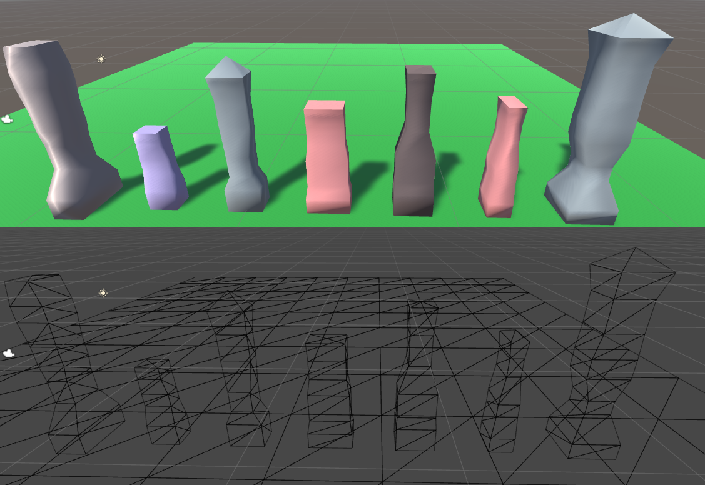
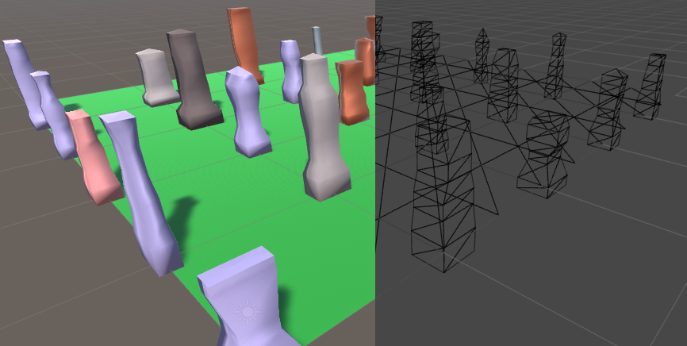
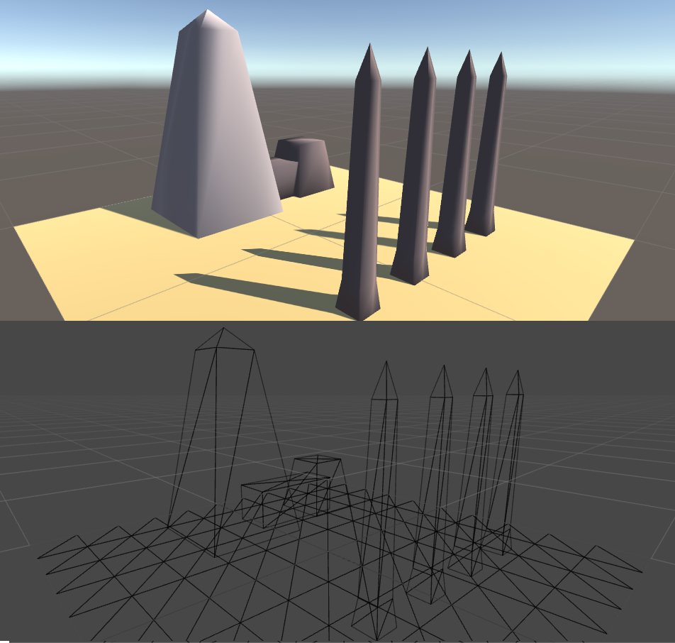
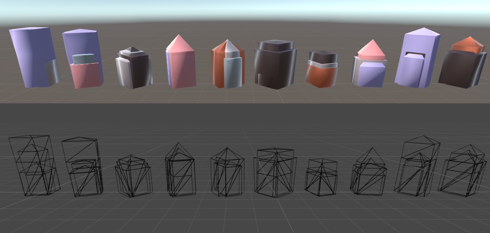
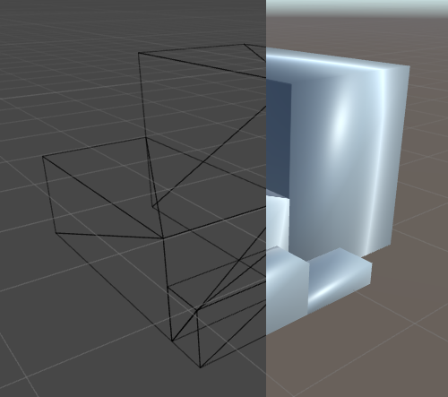
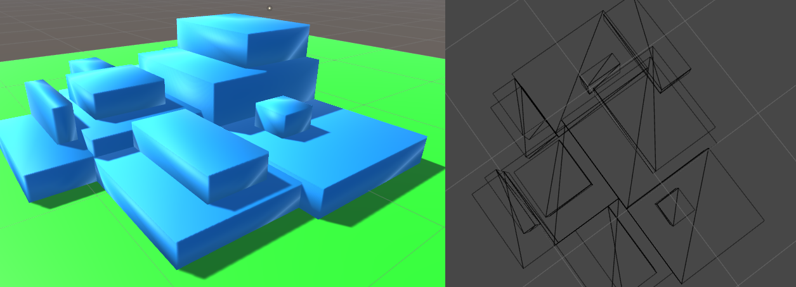

# UnityProceduralBuildings

Service for extruding vertical meshes at runtime or in-engine. Applications are mostly targeting square buildings but the process is extensible to other objectives. Does not require use of an external tool for creating and editing meshes.

Process identifies a series of rectangles centered on 0,0,0 and displaced upwards by a height h. Process draws a series of 3D 4-sided trapezoids between that sequence of rectangles. Process determines how to wind triangles such that meshes always face outwards from the x = 0, y in [-inf, inf], z = 0 line.

ScriptBuildingBuilder can create visually differentiable meshes at runtime.

ScriptSegmentedBuilder can sample from a user-defined space, constraining outcomes to ones the user desires.

Overlapping meshes can be used to create an art deco style of building.

ScriptMultiBuilding can create offset meshes to serve as the base of a more modern, blocky building.

ScriptMultiBuilding can be used to create a composition of blocky buildings with greebles, which help to give the rectangular meshes natural visual breaks.
